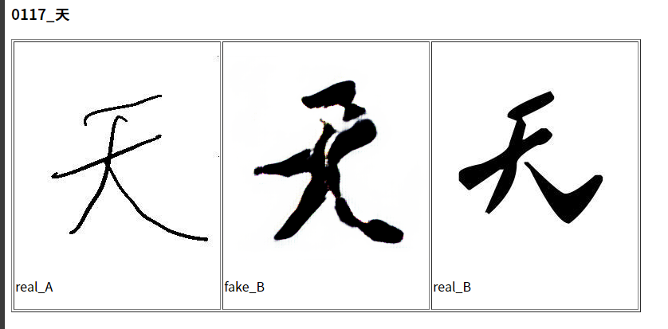
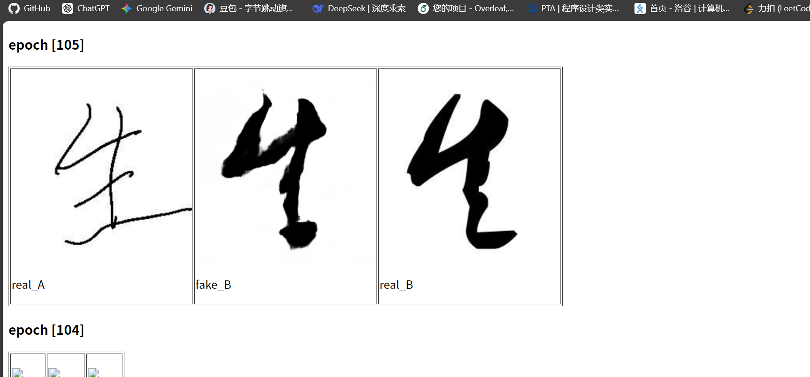

# Zi2Mao-Pix2Pix: 手写汉字到毛体书法的风格迁移

本项目基于 [pix2pix](https://github.com/junyanz/pytorch-CycleGAN-and-pix2pix) 架构，旨在实现将个人的日常手写汉字自动转化为毛泽东书法风格（毛体）的图像到图像翻译模型。

这是一个探索深度学习在中文书法风格迁移中应用的个人实验项目。

## 效果展示 (Demo)





## 环境依赖 (Prerequisites)

本项目在 Windows 环境下测试通过，主要依赖如下：

- Python 3.8以上
- PyTorch (支持 CUDA)
- PyMuPDF (`fitz`) - 用于处理 PDF 字帖提取
- Pillow - 用于图像裁剪与拼接

安装主要依赖：
```bash
pip install torch torchvision PyMuPDF Pillow 

```

## 一. 数据集构建 (Dataset Preparation)

由于中文书法具有复杂的拓扑结构，本项目提供了一套完整的自定义数据集制作脚本，从零开始构建完全空间对齐的配对数据集（Paired Dataset）：

1. `generate_domain_B.py`: 读取目标字体文件（毛体 `.ttf`），批量生成标准尺寸（256x256）的毛体单字图片（Domain B）。
2. `generate_pdf_copybook.py`: 将生成的毛体字转化为带有淡淡水印和田字格的 A4 临摹字帖 PDF，方便进行物理书写与空间对齐。
3. `extract_domain_A.py`: 提取手写完成的 PDF 扫描件，利用阈值二值化自动过滤网格和背景底纹，输出纯净的个人手写单字图片（Domain A）。
4. `create_paired_dataset.py`: 将 Domain A 和 Domain B 的图片按 1:1 左右拼接为 512x256 的宽图，并自动划分为 `train`、`val` 和 `test` 集，生成符合 pix2pix 要求的最终数据集。

## 二. 使用方法 (Usage)

### 1. 训练模型 (Train)

由于中文字符的结构具有方向性，训练时必须关闭默认的随机水平翻转 (`--no_flip`)，并在 Windows 系统下设置 `--num_threads 0` 以避免多线程报错。

```bash
python train.py --dataroot ./my_font_dataset --name my_mao_font --model pix2pix --direction AtoB --num_threads 0 --no_flip --save_epoch_freq 50

```

### 2. 测试模型 (Test)

训练完成后，使用以下命令在测试集上评估模型效果：

```bash
python test.py --dataroot ./my_font_dataset --name my_mao_font --model pix2pix --direction AtoB --num_threads 0

```

测试结果将默认保存在 `results/my_mao_font/test_latest/` 目录下。

## 三. 实验总结与未来改进

在当前仅使用约 100 个汉字对的小样本数据集下，原生 pix2pix 模型容易出现过拟合现象。面对跨度极大的结构形变（如从楷书直接映射到狂草的连笔），模型在未见过的测试集字形上容易生成模糊的像素团。

**下一步优化方向**：

1. 扩充数据集规模至 800 - 1000 个常用汉字。
2. 尝试引入带有条件嵌入（Category Embedding）的针对性汉字生成框架（如 zi2zi）来解耦骨架与笔触。

## 四. 致谢 (Acknowledgments)

本项目的核心生成对抗网络代码克隆并修改自 Junyan Zhu 等人的优秀开源工作：

* [pytorch-CycleGAN-and-pix2pix](https://github.com/junyanz/pytorch-CycleGAN-and-pix2pix)

还有感谢伟大的书法家、政治家、军事家毛主席留下的墨宝！！

